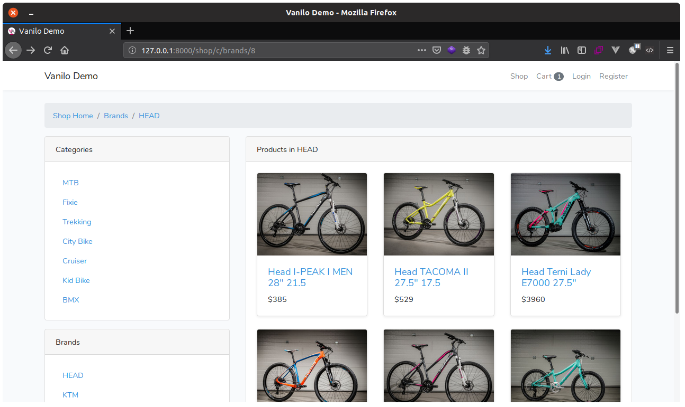
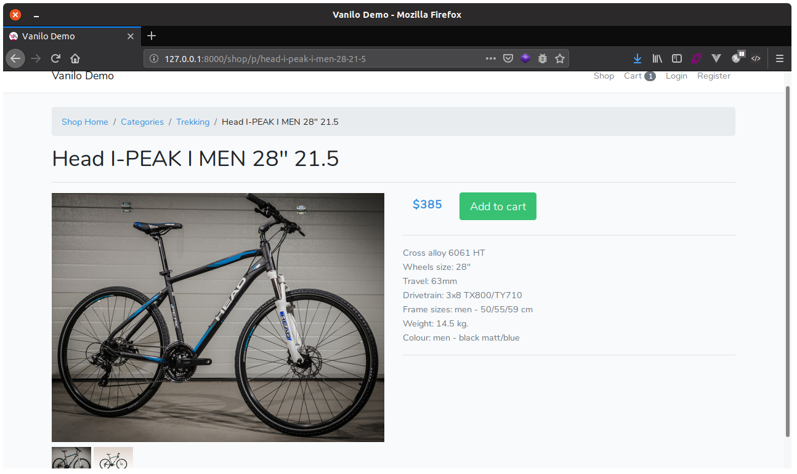
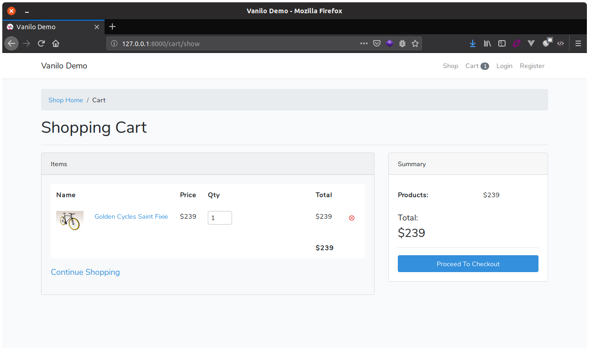
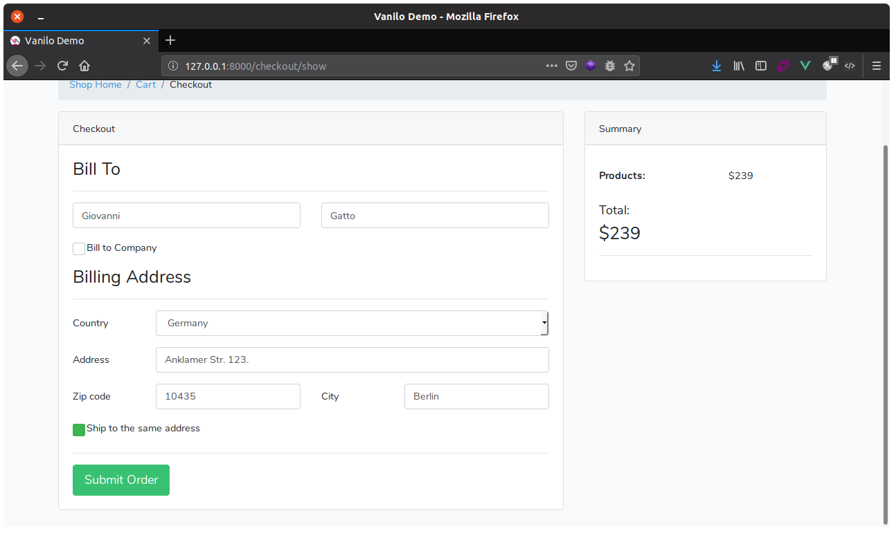
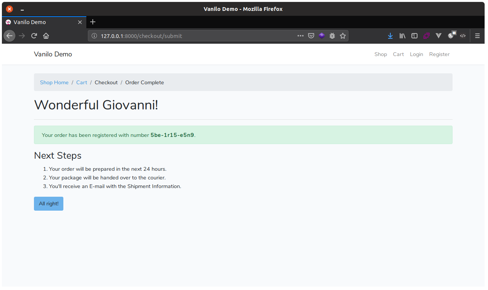
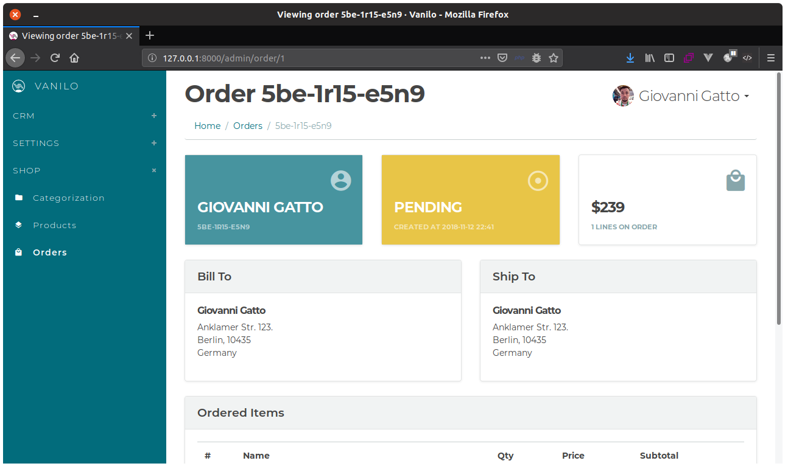
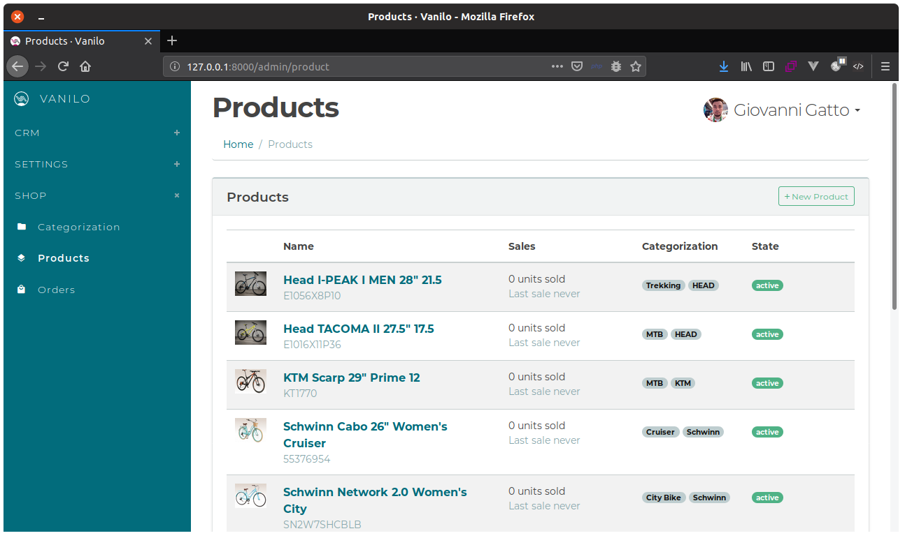
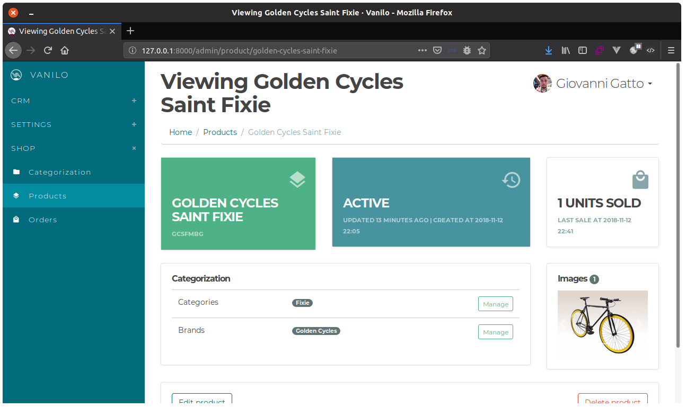
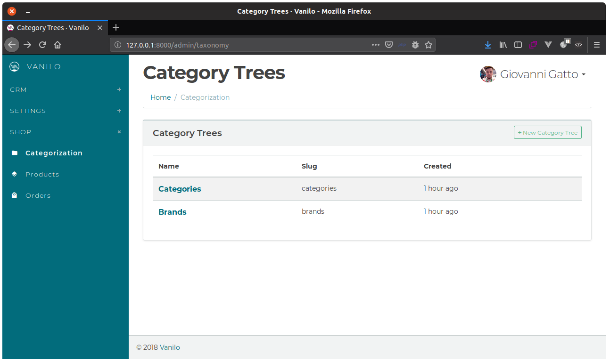

# Vanilo Demo Application


This is a minimalistic Laravel 5.7 application that demonstrates how to build a simple storefront
using the Vanilo framework. It also contains Vanilo's admin panel.

> The app uses the default Bootstrap theme that comes with Laravel.

## Installation

**1. Get the app**:

Either download and decompress [the zipball](https://github.com/vanilophp/demo/archive/0.4.zip)
or use git:

```bash
git clone https://github.com/vanilophp/demo.git
```

**2. Install Dependencies**:

```bash
cd demo/
composer install
```

**3. Configure the environment**:

> The `.env` file is in the app's [root directory](https://laravel.com/docs/5.7/configuration#environment-configuration).

- Create a database for your application.
- Initialize .env (quickly: `cp .env.example .env && php artisan key:generate`.
- add the DB credentials to the `.env` file.

**4. Install Database**:

Run these commands in your terminal:

```bash
php artisan migrate --seed
```
**5. Create the first admin user**:

Run this command:

```bash
php artisan appshell:super
```
Enter your email, name, password, **accept _admin_ as role**.

**6. Open the application**:

Run the site with `php artisan serve` and access the site:

http://127.0.0.1:8000

#### Product List



#### Product Page



#### Cart



#### Checkout



#### Order Thank You



#### Order Admin



#### Products Admin



#### Manage Product



#### Manage Categories




For further details refer to the [Vanilo Documentation](https://vanilo.io/docs/).
