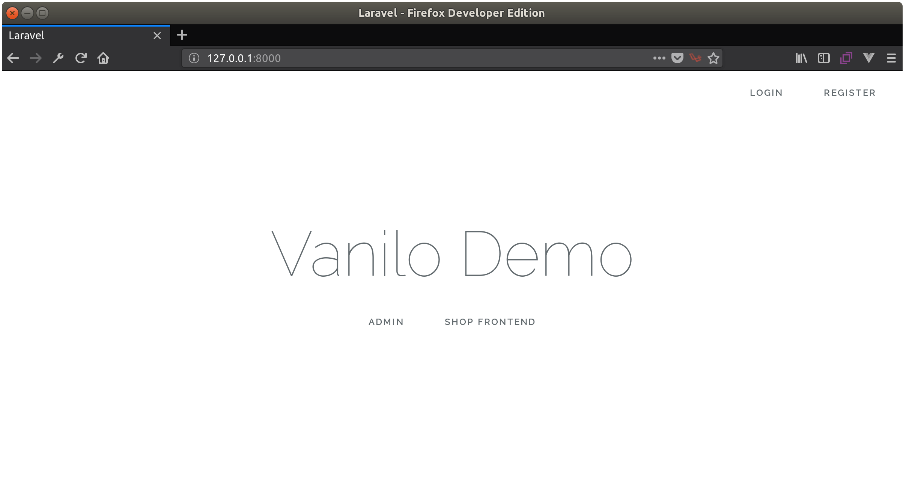
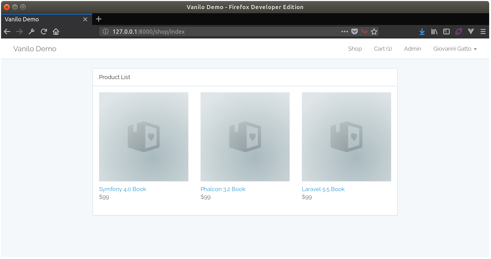
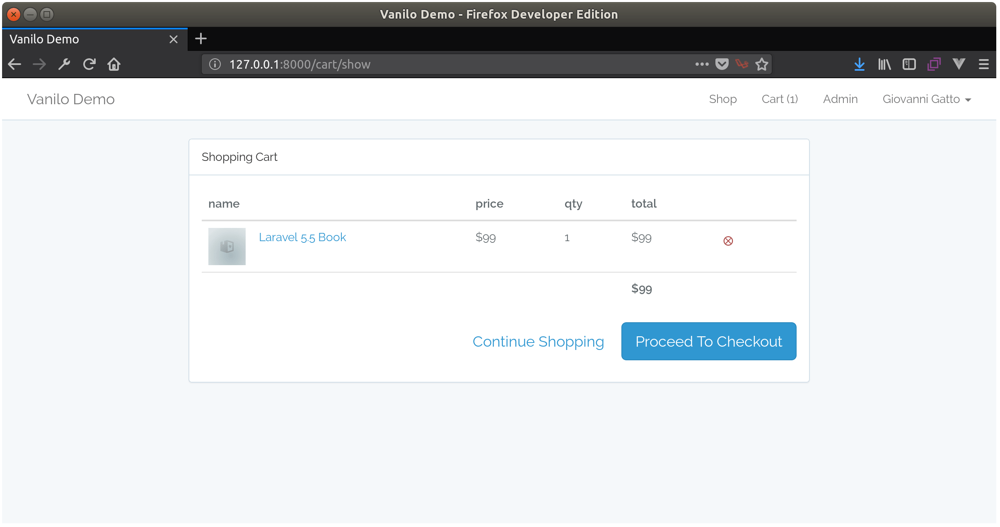
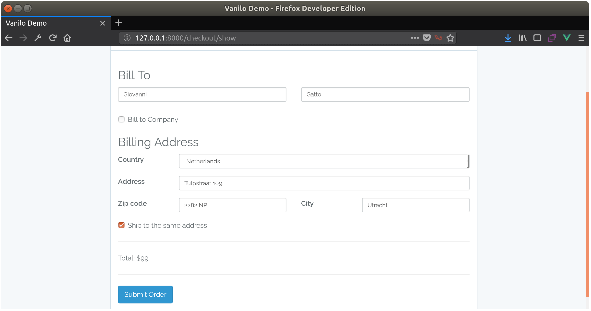
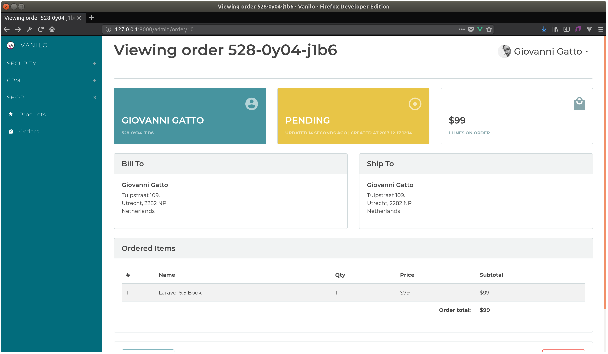
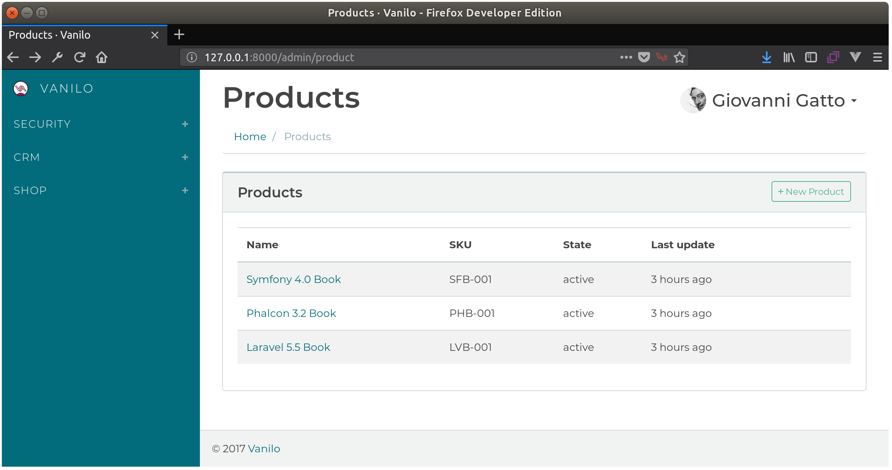

# Vanilo Demo Application

This is a minimalistic Laravel 5.5 application that demonstrates how to build a simple storefront
using the Vanilo framework. It also contains Vanilo's admin panel.

> The app uses the default Bootstrap theme that comes with Laravel.

## Installation

**1. Get the app**:

Either download and uncompress [the zipball](https://github.com/vanilophp/demo/archive/master.zip)
or use git:

```bash
git clone https://github.com/vanilophp/demo.git
```

**2. Install Dependencies**:

```bash
cd demo/
composer install
```

**3. Configure the environment**:

Create a database for your application, and add the credentials to the `.env` file in the app's root
directory.

**4. Install the application**:

Run these commands in your terminal:

```bash
php artisan migrate --seed
yarn install
yarn run dev
```
**5. Create the first admin user**:

Run this command:

```bash
php artisan appshell:super
```
Enter your email, name, password, accept _admin_ as role.

**6. Open the application**:

Run the site with `php artisan serve` and access the site:

http://127.0.0.1:8000

#### Front Page



#### Product List



#### Cart



#### Checkout



#### Orders Admin



#### Products Admin



For further details refer to the [Vanilo Documentation](https://vanilo.io/docs/).
